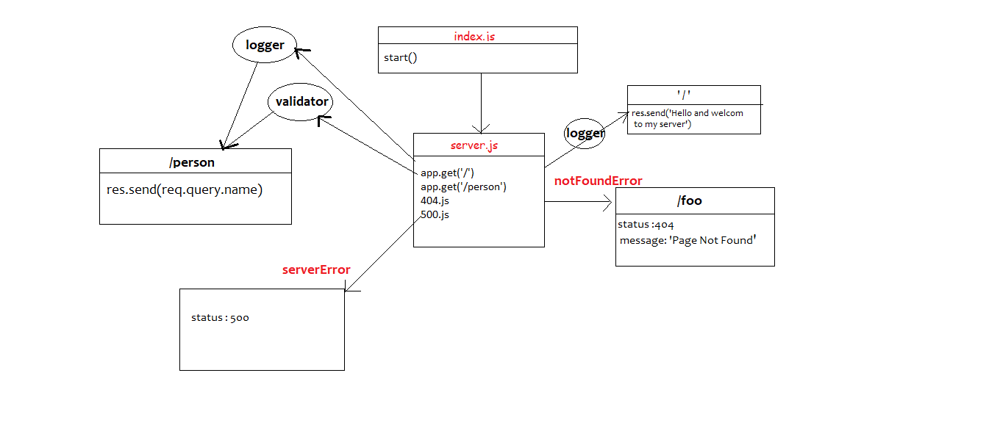

# basic-express-server

# Author: Anwar shraideh

# links

[Heroku-development](https://anwar-basic-express-server.herokuapp.com/)

[pull-request](https://github.com/anwarshraideh/basic-express-server/pull/1)

[repo-link](https://github.com/anwarshraideh/basic-express-server.git)

# Setup

- Clone the repository from GitHub
- Run the command npm i dotenv express jest supertest to install dependencies
- Create .env file with PORT variable
- Run the command npm test to test 
- Start the server using nodemon

# uml

